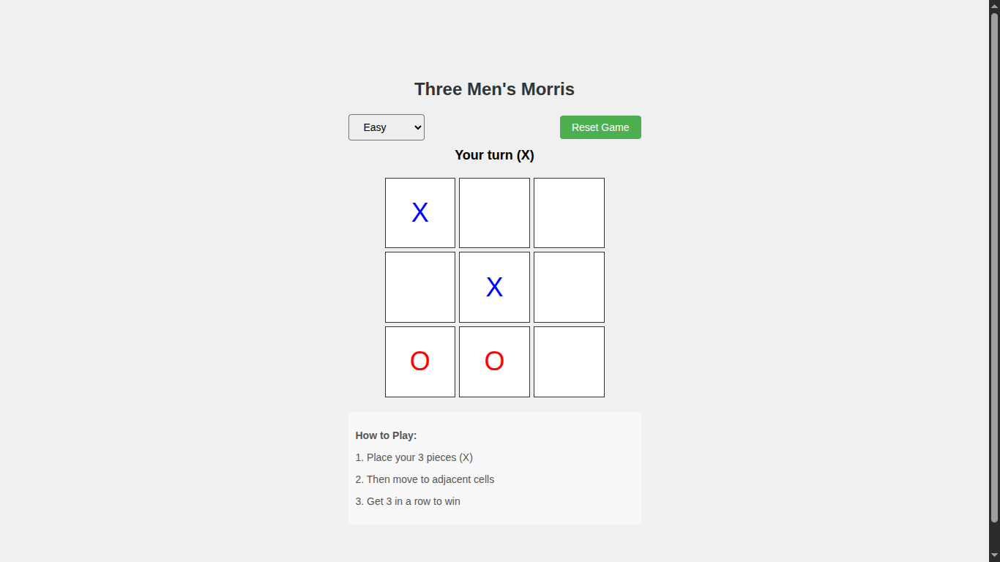

# Three Men's Morris

 *(optional: add screenshot later)*

A classic strategy board game implementation with responsive design and computer opponent.

## Game Rules

Three Men's Morris is an ancient strategy game similar to Tic-Tac-Toe but with more depth:

1. **Placement Phase**: Players take turns placing their 3 pieces on the board
2. **Movement Phase**: After all pieces are placed, players slide their pieces to adjacent spaces
3. **Winning**: First player to get 3 pieces in a row (horizontally, vertically, or diagonally) wins

## Features

- Clean, responsive interface that works on all devices
- Precise movement rules implementation
- Computer opponent with strategic AI
- Visual feedback for selected pieces and valid moves
- Simple, intuitive controls

## Technologies Used

- HTML5
- CSS3 (with responsive design)
- JavaScript (vanilla ES6)

## How to Play

1. **Placement Phase**:
   - Click any empty square to place your piece (X)
   - Computer will place its piece (O) automatically

2. **Movement Phase**:
   - Click your piece to select it (highlighted in blue)
   - Click an adjacent highlighted green square to move
   - Pieces can move to any orthogonally or diagonally adjacent empty space

3. **Winning**:
   - First to get 3 in a row wins!
   - Click "Reset Game" to start over

## Installation

No installation required! Just open `index.html` in any modern web browser.

## File Structure
